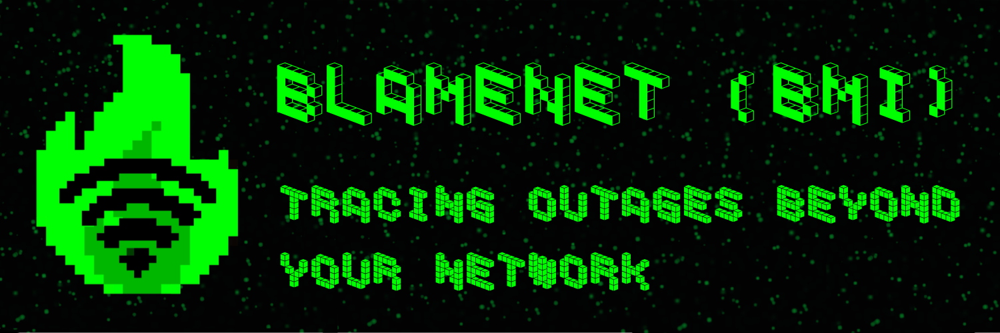

  

# Blame My Internet (BMI)  
## **BlameNet**

**BlameNet** is a network verification tool built to answer one question only:

**Is the target down — or is it you?**

No assumptions. No “works on my machine”.  
Just distributed checks and raw network truth.

> If it’s broken — we’ll tell you who broke it.

---

## ☠ What is this

BlameNet is a lightweight outage detection and fault-localization tool.  
It verifies site availability from multiple external nodes and compares the result with your local connection.

You don’t guess.  
You **trace**.

---

## 🧠 Core idea

When a site doesn’t load, the fault is always somewhere in the chain:

- Your device
- Your network
- Your ISP
- The route
- The target

BlameNet exists to **name the culprit**.

---

## ⚙ How it works

- Multi-node reachability checks
- HTTP / HTTPS probing
- Network path comparison
- Deterministic conclusions

---

## 🕶 Features

- Distributed availability checks
- No user tracking
- No accounts, no bullshit
- Built for CLI and automation
- Fast, minimal, opinionated

---

## 🚧 Project status

Experimental / under active development.  
Expect changes. Expect breakage.

---

## 📜 License

MIT  
Use it. Fork it. Break it. Fix it.

---

## 🖤 Philosophy

- Trust signals, not opinions
- Assume nothing
- Blame correctly

**Tracing outages beyond your network**
